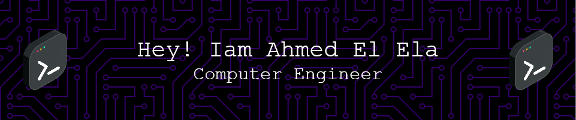

🔴🟡🟢
 

 

  
  &nbsp;
  

  ## 🧭 &nbsp;About Me

  - 📚 Computer engineer at Hogeschool van Amsterdam
  <!-- - 🔭 I'm currently working on <a href="#">MyJob</a> -->

  - 🌱  I’m always studying **Java**, **C**, **C++** and **Robot Engineering**

  `Computer Engineer Student | Software and Hardware Enthusiast`

  ## 📚 &nbsp;Currently studying

  - Java
  - C
  - Embedded Systems

  ## 🛠️ &nbsp;My Tech Stacks
  

&nbsp;
&nbsp;
&nbsp;
&nbsp;
&nbsp;
&nbsp;
&nbsp;
&nbsp;
&nbsp;

  ## 📊 &nbsp;My activities
  
  

  <!-- &nbsp; -->
  &nbsp;
  

